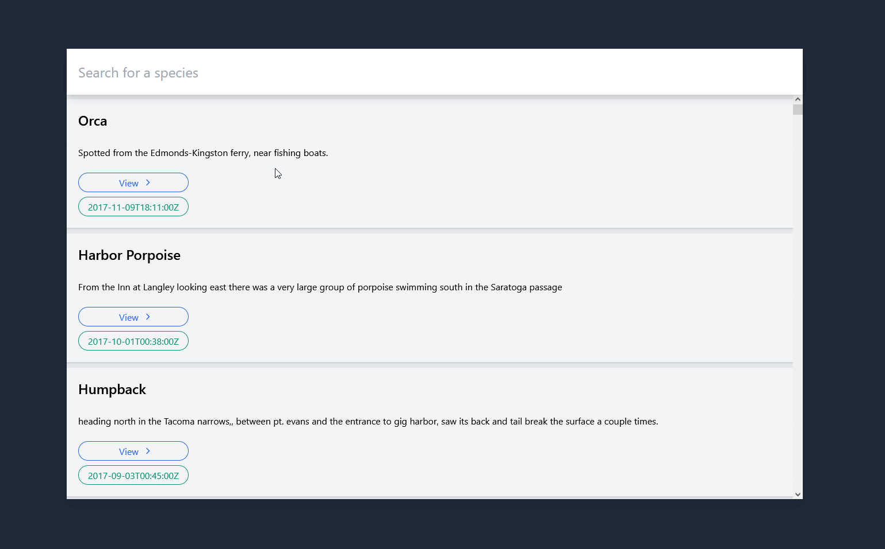

# whales
Search through a whale sighting history API for... no reason!


## Build Setup

```bash
# install dependencies
$ yarn install

# serve with hot reload at localhost:3000
$ yarn dev

# build for production and launch server
$ yarn build
$ yarn start

# generate static project
$ yarn generate
```

Nuxt/Vue/Tailwind
